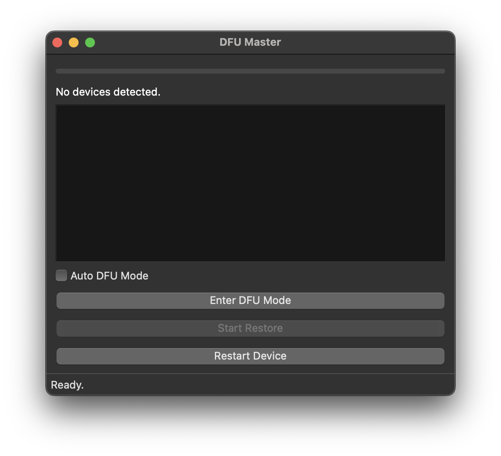

# DFU Master



**DFU Master** is a PySide6-based macOS utility designed to manage Mac device firmware restoration via DFU (Device Firmware Update) mode. It provides a simple GUI for triggering DFU mode, rebooting devices, and restoring firmware using Apple Configurator and `macvdmtool`.

---

## Features

- 🔍 Auto-detect connected Apple devices via `cfgutil`
- 🛠️ Restore firmware from a `.ipsw` file using Apple Configurator
- 💡 Trigger DFU mode using `macvdmtool`
- 🔄 Reboot device command via `macvdmtool`
- ⚙️ Optional automatic DFU on device connect
- 🧠 Background threading for responsive UI
- 📦 Simple GUI with real-time progress and device list

---

## Requirements

- macOS with administrator privileges
- [Apple Configurator](https://apps.apple.com/us/app/apple-configurator/id1037126344?mt=12)
- [`macvdmtool`](https://github.com/ericzhu105/macvdmtool) installed and available in PATH
- Python 3.7+
- Python dependencies:
  - `PySide6`

---

## Setup

1. **Install dependencies and run setup:**

```bash
pip install PySide6
chmod +x setup.sh
sudo ./setup.sh
